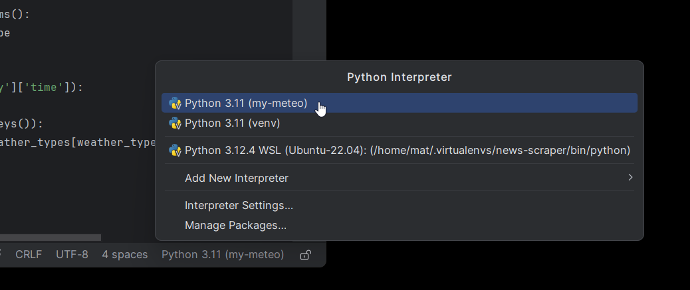
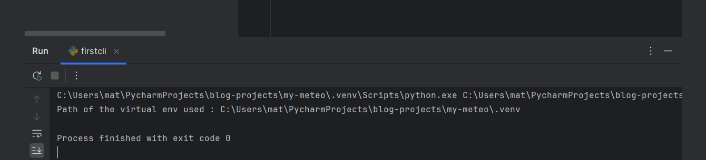
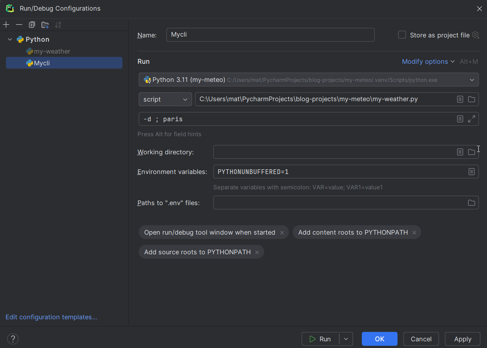
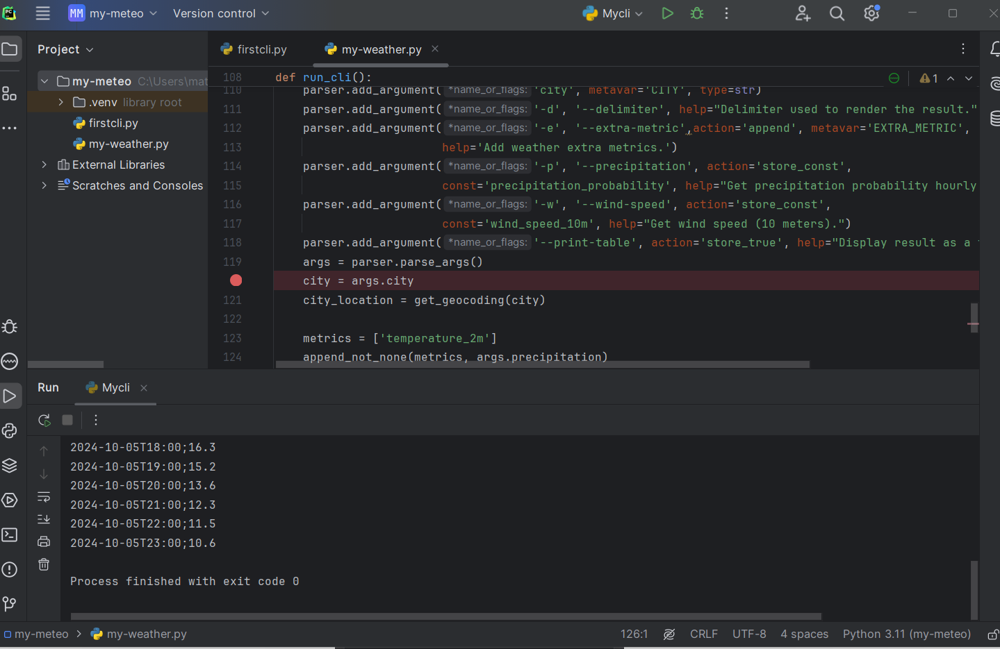
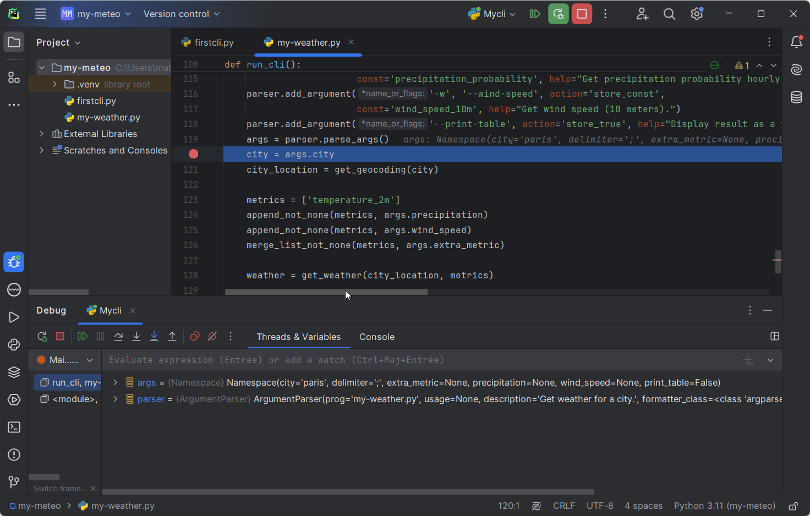

En tant qu'informaticien, j'ai pour principe d'éviter de faire des tâches redondantes avec un ordinateur.
Je déteste répéter plusieurs fois une même action alors qu'il existe un moyen pour l'automatiser. Avant
de commencer une nouvelle tâche ou demande, je prends toujours un peu de temps pour réfléchir, si cette
tâche est ponctuelle ou si dans le futur, je serai amener à la refaire.

Pour le cas d'une demande éphémère (one shot) alors aucune automatisation n'est nécessaire.  
Mais par contre, si je pense qu'il est pertinent d'automatiser alors, je commence une réflexion pour
décrire le processus à développer.

Dans cet article, je vais décrire comment développer des petits outils CLI (en ligne de commande, pour en
anglais command line interface). Il existe un grand de nombre de langages et de bibliothèques pour
développer des CLI avec une tendance pour le Go et le Rust. Pour ma part, je fais un focus sur le
développement avec Python et la bibliothèque native *argparse*. 

Mon objectif est d'avoir un code simple à lire avec un nombre réduit de dépendances. La performance ne
paraît pas primordiale pour la création de petits outils qui seront pour la plupart exécutés sur un PC.  
Attention pour des scripts à déployer en production avec de potentiels impacts, il faut étudier quel sera
langage utilisé sans négliger les tests unitaire et d'intégration (même pour un CLI, il faut faire des
tests).


## Comprendre la syntaxe des CLI
Sur Linux, j'apprécie travailler avec le terminal car les commandes respectent toutes le même pattern.
Ci-dessous le pattern d'une commande avec le vocabulaire associé :
* la commande. Exemple `ls`.
* les options simples. Exemple `-l`.
* les options longues. Avoir un mot explicite à la place d'une simple lettre. Exemple `--human-readable`
  (l'option simple existe avec `-h`).
* les options courtes combinées. Exemple `-l -a` ou identique à `-la`.
* les options avec paramètres. Exemple `-I "*.log"` ou identique à `--ignore "*.log"`.
* les arguments. Partie obligatoire ou optionnelle en fonction des commandes. Exemple `my/path`.

Vous avez compris que je me suis basé sur la commande `ls` qui est utilisé pour afficher les informations
d'un répertoire et son contenu. Il est possible de combiner tous le vocabulaire vu ci-dessus en une seule
commande : `ls -la --human-readable -I "*.log" my/path`.  

Pour développer des scripts CLI en python, je me base sur ce vocabulaire afin de conserver une logique de
fonctionnement universelle. De plus, le langage python étant permissif pour la création de script, il est
important d'avoir quelques règles dans le but de faciliter l'usage des scripts. Ainsi de pouvoir
améliorer son script après plusieurs semaines de pause sans être perdu dans le code !


## Les options classiques d'un script CLI
Avec l'expérience, on remarque souvent des options identiques dans les CLI. En effet, les options
suivantes sont souvent présentes, malgré qu'aucune règle Linux l'impose :
* `-h --help` pour afficher l'aide.
* `-v --verbose` pour afficher des logs étendus.
* `-d --debug` pour afficher des logs très verbeux. Souvent on retrouve soit l'option `-v` ou `d` mais
  rarement les deux réunis.
* `-v --version` pour afficher la version. Parfois le `-v` ne sert pas pour le mode verbose mais est
  utilisé pour afficher la version.

Les options présentées sont des repères pour les utilisateurs. À titre personnel, il m'arrive fréquemment
d'utiliser `-h` pour afficher l'aide, quand j'ai besoin de comprendre le fonctionnement d'une commande et
découvrir les différentes options disponibles.


## Préparer son environnement de développement
Avant de commencer le développement, il est essentiel d'avoir un environnement de développement
confortable. Dans cette partie, je vais utiliser l'IDE (integrated development environment) pour
bénéficier des outils comme l'auto completion, la mode debug et l'accès facile à la documentation. 

Pré-requis :
* Python 3
* Pycharm ou un autre IDE


Créer le projet avec avec le virtual env pour isoler les dépendances. Cela evite d'avoir trop des
dépendances inutiles pour les autres projets python et permet aussi de tracer les dépendances utilisées.
Je créé un projet *my-meteo* puis j'initie le virtual env de python.
```bash
$ mkdir my-meteo
$ cd my-meteo
$ python -m venv .venv (ou python3)
```
En fonction de vos installation de python, vous pourriez utiliser `python3` à la place de `python` si
plusieurs versions de python cohabitent sur votre PC.

Activer le Python dédié à votre projet en utilisant virtual env.
```bash
$ source ./.venv/Scripts/activate
```

Votre ligne de commande est maintenant préfixée par `.venv`.


## Utiliser PyCharm pour développer
Cette partie est optionnelle car elle décrit comment utiliser PyCharm pour développer un CLI. Après avoir
créer son projet en ligne de commande avec le virtual env, nous allons importer ce projet dans PyCharm.

Sur PyCharm, dans le menu contextuel -> Open -> Sélectionner le répertoire du projet.  Utiliser le virtual env confgiuré avec PyCharm. Cliquer sur en bas à droite puis
sélectionner le bon interpréteur (exemple my-meteo). 

Vérifier que l'interpréteur python est bien configuré, pour ce faire créer un simple script python.
```python
import os

virtual_env = os.environ.get('VIRTUAL_ENV')
if virtual_env:
    print(f'Path of the virtual env used : {virtual_env}')
else:
    print('No virtual env found')
```

Puis l'executer en faisant clique droit sur l'onglet du script pour ouvrir le menu, puis run.



Le script affiche le chemin du `VIRTUAL_ENV` utilisé. Dans cet exemple, il s'agit bien de celui rattaché
au projet. 

La configuration de PyCharm est maintenant fonctionnelle pour commencer à développer.


## Créer son premier CLI
Le choix a été fait de se baser sur un exemple de création d'un CLI de météo.  
Ceci nous permettra d'explorer les différentes fonctionnalités à travers un cas concret. Dans un premier
temps, notre CLI doit afficher la température heure par heure pour la ville saisie. L'exemple ci-dessous
donne le résultat pour Paris.
```bash
$ python my-weather.py Paris
day-hour temperature_2m
2024-09-17T00:00 15.2
2024-09-17T01:00 14.6
2024-09-17T02:00 14.8
2024-09-17T03:00 14.5
2024-09-17T04:00 14.1
2024-09-17T05:00 13.8
...
```

D'autres options secondaire sont à rajouter :
* la probabilité d'avoir de la pluie
* la vitesse du vent
* le format d'affichage du résultat
* la possibilité de rajouter d'autres metrics de météo dynamiquement


La bibliothèque *Argparse* est utiliser pour gérer les différents entrée et choix par l'utilisateur qui
utilisera la CLI. Ci-dessous, j'ai coder le squelette avec *Argparse* : 
```python
parser = argparse.ArgumentParser(description='Get weather for a city.')
parser.add_argument('city', metavar='CITY', type=str)
parser.add_argument('-d', '--delimiter', help="Delimiter used to render the result.", type=str, default=" ")
parser.add_argument('-e', '--extra-metric',action='append', metavar='EXTRA_METRIC',
                    help='Add weather extra metrics.')
parser.add_argument('-p', '--precipitation', action='store_const',
                    const='precipitation_probability', help="Get precipitation probability hourly.")
parser.add_argument('-w', '--wind-speed', action='store_const',
                    const='wind_speed_10m', help="Get wind speed (10 meters).")
parser.add_argument('--print-table', action='store_true', help="Display result as a table.")
args = parser.parse_args()
city = args.city
```

Le nom de la ville est obligatoire car c'est l'argument principal de la CLI. Si je lance le CLi sans la
ville alors une erreur s'affiche pour m'indiquer que *CITY* doit être renseigné :
```bash
python my-weather.py
usage: my-weather.py [-h] [-d DELIMITER] [-e EXTRA_METRIC [EXTRA_METRIC ...]] [-p] [-w] [--print-table] CITY
my-weather.py: error: the following arguments are required: CITY
```

Enfin différentes options existent pour rendre polyvalent notre CLI:
* `-d` ou `--delimiter `pour afficher les résultat en remplaçant le délimiteur espace par un autre
  caractère.  
Example avec un point virgule :
```bash
$ python my-weather.py -d ";" Paris
day-hour;temperature_2m
2024-09-17T00:00;15.2
2024-09-17T01:00;14.6
2024-09-17T02:00;14.8
```
* `-e` ou `--extra-metric` pour requêter d'autres éléments de l'API météo.  
Un exemple pour avoir la quantité de pluie et la visibilité. C'est une bonne pratique de mettre un
caractère comme une option simple et aussi une chaîne de caractère pour la même option) 
```bash
$ python my-weather.py -e rain -e visibility "Paris"
day-hour temperature_2m rain visibility
2024-09-17T00:00 15.2 0.0 36400.0
2024-09-17T01:00 14.6 0.0 31140.0
2024-09-17T02:00 14.8 0.0 27480.0
```
* `-p` (ou manière longue) pour récupérer la probabilité de précipitation.
```bash
$ python my-weather.py -p Paris
day-hour temperature_2m precipitation_probability
2024-09-17T00:00 15.2 0
2024-09-17T01:00 14.6 0
2024-09-17T02:00 14.8 0
```
* `-w` (ou manière longue) pour récupérer la vitesse du vent.
```bash
$ python my-weather.py -w Paris
day-hour temperature_2m wind_speed_10m
2024-09-17T00:00 15.2 12.0
2024-09-17T01:00 14.6 12.0
2024-09-17T02:00 14.8 12.0

```
* `--print-table` ici la manière explicite est le seul moyen d'utiliser cette option pour afficher le
  résultat sous la forme d'un tableau optimisé pour la lecture.
```bash
python my-weather.py --print-table Paris
+------------------+----------------+
|         day-hour | temperature_2m |
+------------------+----------------+
| 2024-09-17T00:00 |           15.2 |
| 2024-09-17T01:00 |           14.6 |
| 2024-09-17T02:00 |           14.8 |
...
```

Il est aussi possible de mixer options :
```bash
python my-weather.py -p -w --extra-metric rain -e visibility  --print-table Paris
+------------------+----------------+---------------------------+----------------+------+------------+
|         day-hour | temperature_2m | precipitation_probability | wind_speed_10m | rain | visibility |
+------------------+----------------+---------------------------+----------------+------+------------+
| 2024-09-17T00:00 |           15.2 |                         0 |           12.0 |  0.0 |    36400.0 |
| 2024-09-17T01:00 |           14.6 |                         0 |           12.0 |  0.0 |    31140.0 |
| 2024-09-17T02:00 |           14.8 |                         0 |           12.0 |  0.0 |    27480.0 |
...
```

Nous avons vu globalement les différents méthodes pour créer une CLI en fonction des options demandées.


## Le fonctionnement basique de *Argparse*

La bibliothèque est présente par défaut dans l'installation de python. Il suffit de l'importer via :
```python
import argparse
```

Par la suite, il faut définir et affecter le parseur via :
```python
parser = argparse.ArgumentParser(description='Get weather for a city.')
```

Maintenant, nous pouvons définir les différentes arguments et options pour notre CLI.
```python
parser.add_argument('city', metavar='CITY', type=str)
parser.add_argument('-d', '--delimiter', help="Delimiter used to render the result.", type=str, default=" ")
parser.add_argument('-e', '--extra-metric',action='append', metavar='EXTRA_METRIC',
                    help='Add weather extra metrics.')
parser.add_argument('-p', '--precipitation', action='store_true',
                    const='precipitation_probability', help="Get precipitation probability hourly.")
parser.add_argument('-w', '--wind-speed', action='store_true',
                    const='wind_speed_10m', help="Get wind speed (10 meters).")
parser.add_argument('--print-table', action='store_true', help="Display result as a table.")
```
Les valeurs saisies sont récupérées dans args avec comme type Namespace :
```python
args = parser.parse_args()
```

Enfin l'accès aux valeurs se fait simplement comme pour *get* les propriétés d'un objet. Le typage
(string, bool...) est respecté en fonction du type dans la CLI.
```python
city = args.city
precipitation = args.precipitation
```

C'est la fin d'utilisation d'*Argparse* car tous les éléments de la CLI ont été récupérés. Aussi nous
savons que les éléments obligatoires ont tous été saisis par l'utilisateur car sinon un message d'erreur
est généré automatiquement dans la console.


## Les différentes paramètres
Dans les exemples précédents,  les paramètres sont utilisés pour faciliter la gestion du typage, des
valeurs obligatoire et de l'affichage de l'aide.

Le typage se définit simplement avec `type=str`. Il est possible d'utiliser n'importe quel type python et
définir une fonction pour vérifier un type particulier (par example chemin d'un fichier pour vérifier
s'il existe). Documentation https://docs.python.org/3/library/argparse.html#type.

Les valeurs par défaut sont gérées par `default=" "`. Lorsqu'aucune valeur n'est saisie alors le CLI
affectera cette valeur.

L'aide pour le CLI doit être créée avec `help="Field to create...` pour qu'elle s'affiche lorsque
l'utilisateur lance le script avec `-h` ou `--help`. Il est conseille de renseigné le champs `metavar=`
lorsque qu'une valeur peut être saisie car cela permet de clarifier l'aide affichée.

Quelques cas nécessitent de forcer le nom du champs qui sera créé au moment du parsing de la CLI par
*Argparse*. Cela est utile quand une option à le même nom (cas rare), pour ce faire utiliser
`const='wind_speed_10m'` et la valeur sera sauveharder dans `args.wind_speed_10m`.

Le paramètre `action=` permet de définir un comportement avancé. L'action la plus utilisée est
`action='store_true` car quand une option est saisie par l'utilisateur alors celle-ci aura comme valeur
True et sinon False. je recommande de consulter la documentation pour voir toutes les capacités
https://docs.python.org/3/library/argparse.html#action.


## Déboguer durant le développement
Dans mon cas, je vais utiliser le debugger intégré à PyCharm. Il se configure facilement en lui indiquant
le fichier contenant le script et les différentes options et arguments que nous souhaitons déboguer.

Dans le menu de PyCharm, ouvrir le *config editor* : menu -> Run -> Edit Configurations... !


Sur la fenêtre ouverte, créer (ou utiliser un déjà existant) une nouvelle configuration Python via la
bouton *+*.


Ensuite renseigner les différentes informations :
* Name: nom afficher dans PyCharm.
* Vérifier que la version de python correspond à bien celle utilisée avec *venv*. Le path doit être
  identique.
* Script : chemin du fichier python à exécuter.
* Script paramaters : les options et arguments utilisés. exemple : `-d ; paris`.




Valider la configuration en cliquant sur *Apply*.  
Puis lancer le script en debug en cliquant sur options du bouton *Run*. 



Rassurez vous ces étapes sont à faire une seule fois pour la configuration.

L'IDE lance le script en mode debug avec les options et paramètres renseignées.

En haut de la fenêtre le bouton debug est apparu.


Maintenant, je peux positionner des points d'arrêts dans le code. 

Enfin lorsque, je clique sur le bouton *Debug*, PyCharm exécute mon script en s'arrêtant sur mon point
d'arrêt.  


Libre à vous d'utiliser le debug de manière efficace ! Par exemple, vérifier un algorithme pas à pas,
inspecter le contenu d'une variable ou d'un objet, appeler une fonction...


## Exemple complet de CLI
J'ai codé un exemple de CLI très rudimentaire pour afficher la météo d'une ville avec quelques options.  
Les données météorologiques sont récupérées via une API HTTP en utilisant le module *Request* en Python.
J'ai choisi *open-meteo.com* comme source de données car l'API ne nécessite pas d'authentification et
propose quelques options pour récupérer des éléments comme la température ou l'humidité des coordonnées
GPS. Les coordonnées GPS d'une ville sont calculées en utilisant l'API du service public des adresses. 

Dans le code, j'ai implémenté la logique pour traiter les options saisies par l'utilisateur et gérer
quelques cas d'erreur lorsqu'une ville n'a pas été trouvé sur l'API des adresses ou qu'une option
n'existe pas.

Pour résumer, le code suit les étapes suivantes :
* récupération des valeurs saisies et options.
* requête API pour déterminer les coordonnées GPS de ville.
* requête API avec les options demandées et les coordonnées GPS pour avoir les prévisions météos.

Nécessite au préalable l'installation du module `requests` et `prettytable` (`pip install <module_name>`).

Utiliser l'aide avec `-h` pour avoir la description !

```Python
import argparse
from dataclasses import dataclass

import requests
from prettytable import PrettyTable


@dataclass
class CityLocation:
    city: str
    lat: float
    lon: float


def get_geocoding(city: str) -> CityLocation:
    """
    Get latitude and longitude of a city.
    :param city:
    :return:
    """
    params = {
        'q': city,
    }
    response = requests.get('https://api-adresse.data.gouv.fr/search/', params=params)
    if response.status_code != 200:
        raise ConnectionError(f'Failed to query city localization {response.text}')

    data = response.json()
    for entry in data['features']:
        if entry['properties']['type'] == 'municipality':
            return CityLocation(city=entry['properties']['municipality'],
                                lat=entry['geometry']['coordinates'][1],
                                lon=entry['geometry']['coordinates'][0])
    raise ValueError(f'No municipality found for {city}')


def get_weather(city_location: CityLocation, metrics) -> dict:
    """
    Find weather for the given city localization.
    :param city_location:
    :param metrics:
    :return:
    """
    hourly = ",".join(metrics)
    params = {
        'latitude': city_location.lat,
        'longitude': city_location.lon,
        'forecast_days': 1,
        'timezone': 'auto',
        'hourly': hourly
    }
    response = requests.get('https://api.open-meteo.com/v1/forecast', params=params)
    if response.status_code != 200:
        raise ConnectionError(f'Failed to query city localization {response.text}')
    return response.json()


def print_weather(weather, delimiter: str) -> None:
    weather_types = {}

    for weather_type, value in weather['hourly'].items():
        if weather_type != 'time':
            weather_types[weather_type] = value

    header = "day-hour"
    for weather_type, value in weather_types.items():
        header = header + delimiter + weather_type
    print(header)

    for index, hour, in enumerate(weather['hourly']['time']):
        result = hour
        for weather_type in list(weather_types.keys()):
            result = result + delimiter + str(weather_types[weather_type][index])
        print(result)


def print_as_table(weather):
    weather_types = {}
    table = PrettyTable()
    table.align = 'r'
    for weather_type, value in weather['hourly'].items():
        if weather_type != 'time':
            weather_types[weather_type] = value

    headers = ['day-hour']
    for weather_type, value in weather_types.items():
        headers.append(weather_type)
    table.field_names = headers

    for index, hour, in enumerate(weather['hourly']['time']):
        columns = [hour]
        for weather_type in list(weather_types.keys()):
            columns.append(weather_types[weather_type][index])
        table.add_row(columns)
    print(table)


def append_not_none(array, param) -> None:
    if param is not None:
        array.append(param)


def merge_list_not_none(array, param) -> None:
    if param is not None:
        array.extend(param)


def run_cli():
    parser = argparse.ArgumentParser(description='Get weather for a city.')
    parser.add_argument('city', metavar='CITY', type=str)
    parser.add_argument('-d', '--delimiter', help="Delimiter used to render the result.", type=str, default=" ")
    parser.add_argument('-e', '--extra-metric',action='append', metavar='EXTRA_METRIC',
                        help='Add weather extra metrics.')
    parser.add_argument('-p', '--precipitation', action='store_const',
                        const='precipitation_probability', help="Get precipitation probability hourly.")
    parser.add_argument('-w', '--wind-speed', action='store_const',
                        const='wind_speed_10m', help="Get wind speed (10 meters).")
    parser.add_argument('--print-table', action='store_true', help="Display result as a table.")
    args = parser.parse_args()
    city = args.city
    city_location = get_geocoding(city)

    metrics = ['temperature_2m']
    append_not_none(metrics, args.precipitation)
    append_not_none(metrics, args.wind_speed)
    merge_list_not_none(metrics, args.extra_metric)

    weather = get_weather(city_location, metrics)

    if args.print_table:
        print_as_table(weather)
    else:
        print_weather(weather, args.delimiter)


if __name__ == '__main__':
    run_cli()

```